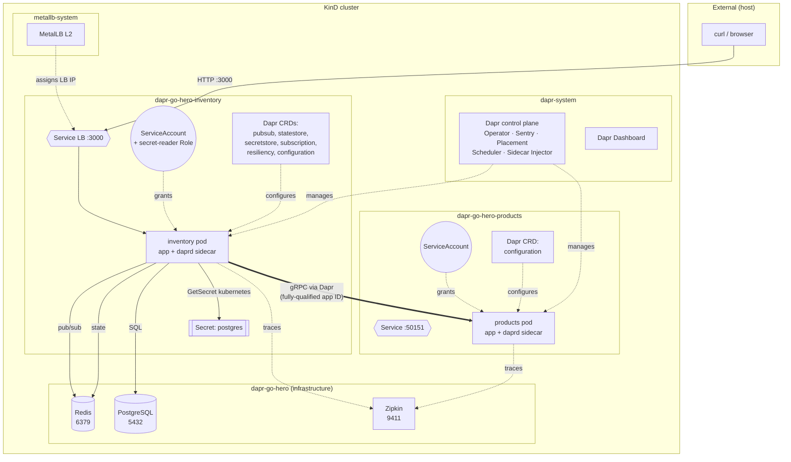
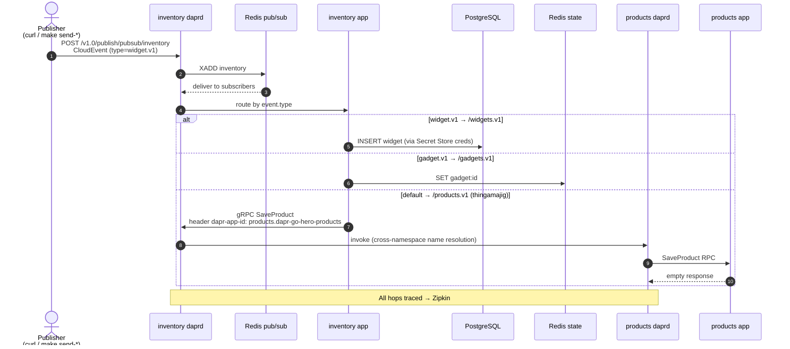

[](https://github.com/AndriyKalashnykov/dapr-go-hero/actions/workflows/ci.yml)
[](https://hits.sh/github.com/AndriyKalashnykov/dapr-go-hero/)
[](https://opensource.org/licenses/MIT)
[](https://app.renovatebot.com/dashboard#github/AndriyKalashnykov/dapr-go-hero)

# dapr-go-hero

Reference implementation of a Go microservice platform on [Dapr](https://dapr.io), comparing three client approaches (custom HTTP, custom gRPC, Dapr Go SDK) across four Dapr building blocks: Pub/Sub with content-based routing, State Store, Secret Store, and Service Invocation. Production-ready K8s deployment with KinD + MetalLB for local parity, Testcontainers-backed integration tests, and a CI pipeline that provisions a full Dapr cluster on every PR.

[Slides](slides.pdf)

## Tech Stack

| Layer | Technology | Rationale |
|-------|-----------|-----------|
| Language | Go 1.26 | Static binaries, minimal runtime, strong concurrency primitives |
| Dapr runtime | v1.17 | Decouples building-block APIs from broker/store implementations |
| HTTP framework | [Fiber v3](https://gofiber.io/) | Fasthttp-backed; lower allocation/request than `net/http` under load |
| Database driver | [pgx v5](https://github.com/jackc/pgx) | Native Postgres protocol + prepared-statement pooling (no `database/sql` overhead) |
| Event backbone | Redis Streams (pub/sub) + Redis (state) | Dapr's default low-ceremony broker; swap-in any supported backend via component YAML |
| RPC | gRPC + Protobuf | Strongly-typed inter-service contracts, HTTP/2 multiplexing, native tracing headers |
| Container | Alpine + BuildKit cache mounts | ~12–21 MB images; `go mod download` cached across builds |
| Orchestration | Kubernetes + KinD + MetalLB (L2) | LoadBalancer Service support in KinD — closes the parity gap with cloud K8s |
| Observability | Zipkin via Dapr sidecar | Zero-code distributed tracing; Dapr propagates W3C Trace Context across hops |
| Secrets | `secretstores.kubernetes` (K8s-native) | RBAC-scoped; no external Vault dependency |
| Resiliency | Dapr `Resiliency` CRD | Declarative retries, timeouts, circuit breakers per target app/component |
| Test layers | Unit (Go testing), Integration (Testcontainers), E2E (KinD + curl) | Each layer catches a different class of defect |
| Code quality | golangci-lint, gosec, hadolint, mermaid-cli | Enforced via composite `make static-check` gate |
| Dependency updates | [Renovate](https://docs.renovatebot.com/) | Single `customManagers` regex tracks every `_VERSION` constant |

## Building Blocks Demonstrated

| Block | Component | Store | Access pattern |
|-------|-----------|-------|----------------|
| Pub/Sub (content-routed) | `pubsub.redis` | Redis Streams | CloudEvent type → declarative Subscription route |
| State Store | `state.redis` | Redis | Dapr Go SDK key/value API |
| Secret Store | `secretstores.kubernetes` | K8s Secrets | Credentials fetched at startup, no env vars |
| Service Invocation | Dapr sidecar-to-sidecar | gRPC | Fully-qualified app ID for cross-namespace routing, mTLS, Zipkin traces |

## Quick Start

Two delivery modes. Kubernetes (Option A) is closest to production; local dev (Option B) iterates faster on single-binary changes.

### Option A — Kubernetes (KinD + MetalLB + Dapr)

```bash
make e2e-setup     # create KinD cluster, install MetalLB + Dapr + Dashboard, deploy stack
make e2e           # run 7 end-to-end assertions against the deployed cluster
make k8s-status    # show pods/services across all namespaces
make e2e-teardown  # destroy everything
```

Access deployed services via `kubectl port-forward`:

| Service | Local URL | Port-forward command |
|---------|-----------|----------------------|
| Inventory REST API | http://localhost:3000 | `kubectl port-forward svc/inventory 3000:3000 -n dapr-go-hero-inventory` |
| Dapr Dashboard | http://localhost:8080 | `kubectl port-forward svc/dapr-dashboard 8080:8080 -n dapr-system` |
| Zipkin UI | http://localhost:9411 | `kubectl port-forward svc/zipkin 9411:9411 -n dapr-go-hero` |
| Redis | localhost:6379 | `kubectl port-forward svc/redis 6379:6379 -n dapr-go-hero` |
| PostgreSQL | localhost:5432 | `kubectl port-forward svc/postgres 5432:5432 -n dapr-go-hero` |

Query examples:

```bash
curl http://localhost:3000/v1/widgets/widget | jq
curl http://localhost:3000/v1/gadgets/gadget | jq
curl http://localhost:3000/v1/products/thingamajig | jq
```

### Option B — Local dev (standalone binaries)

Single-binary processes with a Dapr sidecar each. Useful for tight feedback loops on code changes.

```bash
make deps           # install mise + pinned tool versions
make build          # compile both binaries
make test           # unit tests
make run-products   # terminal 1: products gRPC service
make run            # terminal 2: inventory service (default: SDK HTTP mode)
make send-all       # terminal 3: publish 3 CloudEvents
make get-all        # query REST endpoints
```

Local dev requires a running PostgreSQL container and `secrets.json`. See [Local dev setup](#local-dev-setup).

## Prerequisites

**Core (both modes):**

| Tool | Version | Purpose |
|------|---------|---------|
| [Git](https://git-scm.com/) | 2.0+ | Version control |
| [Go](https://go.dev/dl/) | 1.26.2+ | Auto-installed via [mise](https://mise.jdx.dev) on `make deps` |
| [GNU Make](https://www.gnu.org/software/make/) | 3.81+ | Build orchestration |
| [Docker](https://www.docker.com/) | BuildKit-enabled | Container builds; required by integration tests (Testcontainers) |
| [jq](https://jqlang.github.io/jq/) | any | JSON response formatting |

**Kubernetes mode (Option A):**

| Tool | Version | Purpose |
|------|---------|---------|
| [KinD](https://kind.sigs.k8s.io/) | 0.31+ | Local Kubernetes control plane in a container |
| [kubectl](https://kubernetes.io/docs/tasks/tools/) | bundled with KinD | K8s CLI |
| [Dapr CLI](https://docs.dapr.io/getting-started/install-dapr-cli/) | 1.17+ | `dapr init -k` installs runtime into KinD |

**Local dev mode (Option B):**

| Tool | Version | Purpose |
|------|---------|---------|
| [Dapr CLI](https://docs.dapr.io/getting-started/install-dapr-cli/) | 1.17+ | `dapr init` provides self-hosted Redis + Zipkin |
| PostgreSQL | 16+ | Run as Docker container, see [Local dev setup](#local-dev-setup) |

**Optional:**

| Tool | Purpose |
|------|---------|
| [protoc](https://grpc.io/docs/protoc-installation/) | Regenerate gRPC code from `proto/products/products.proto` |
| [act](https://github.com/nektos/act) | Run GitHub Actions workflow locally (`make ci-run`) |
| [hadolint](https://github.com/hadolint/hadolint) | Auto-installed by `make docker-lint` |

Install everything:

```bash
make deps
```

## Make Targets

Run `make help` for the full list.

### Build & Test

| Target | Description |
|--------|-------------|
| `make build` | Compile both binaries (static, CGO disabled) |
| `make test` | Unit tests (`go test -race ./...`) |
| `make integration-test` | Integration tests against real PostgreSQL (Testcontainers) |
| `make clean` | Remove build artifacts |
| `make update` | `go get -u ./... && go mod tidy` |

### Quality Gates

| Target | Description |
|--------|-------------|
| `make static-check` | Composite gate: lint + sec + mermaid-lint + deps-prune-check |
| `make lint` | golangci-lint (with gocritic) + mermaid-lint |
| `make sec` | gosec SAST scan |
| `make mermaid-lint` | Validate Mermaid diagrams via `minlag/mermaid-cli` Docker image |

### CI

| Target | Description |
|--------|-------------|
| `make ci` | Full local pipeline: deps → static-check → test → integration-test → build |
| `make ci-run` | Execute GitHub Actions workflow locally via [act](https://github.com/nektos/act) |

### Dapr Services

| Target | Description |
|--------|-------------|
| `make run` | Inventory service with Dapr (default: SDK HTTP mode) |
| `make run-products` | Products gRPC service |
| `make run-custom-http` | Inventory with custom HTTP client |
| `make run-custom-grpc` | Inventory with custom gRPC client |
| `make run-sdk-http` | Inventory with Dapr Go SDK over HTTP |
| `make run-sdk-grpc` | Inventory with Dapr Go SDK over gRPC |
| `make dapr-test` | Dapr sidecar only (no app) — useful for API debugging |

### Events & Queries

| Target | Description |
|--------|-------------|
| `make send-widget` / `send-gadget` / `send-thingamajig` | Publish individual CloudEvents |
| `make send-all` | Publish all three event types |
| `make get-widget` / `get-gadget` / `get-thingamajig` | GET individual items |
| `make get-all` | GET all three |

### Docker & Kubernetes

| Target | Description |
|--------|-------------|
| `make docker-build` | Build both images (BuildKit + cache mounts) |
| `make docker-push` | Push to `$(REGISTRY)` |
| `make docker-lint` | Hadolint on Dockerfiles |
| `make kind-up` | Create KinD cluster + MetalLB + Dapr + Dashboard |
| `make kind-down` | Destroy cluster |
| `make k8s-deploy` | Build images, load into KinD, apply all manifests |
| `make k8s-undeploy` | Remove all manifests |
| `make k8s-status` | Pod/service status across namespaces |
| `make e2e` | Run `tests/e2e.sh` against deployed cluster |
| `make e2e-setup` / `e2e-teardown` | Composite setup/teardown |

### Utilities

| Target | Description |
|--------|-------------|
| `make deps` | Install pinned tools (idempotent) |
| `make deps-check` | Show mise + Go status |
| `make deps-prune` / `deps-prune-check` | Verify no unused go.mod entries |
| `make generate-env` | Regenerate `.env` from `pkg/config` defaults |
| `make release` | Tag and push a new semver release |
| `make renovate-validate` | Dry-run Renovate config |

## Design Rationale

### Package organization

Organized by feature (`pkg/features/{widgets,gadgets,products}`), not by type. Dapr pub/sub requires a single callback URL per app, so each feature's subscriptions are merged in `pkg/dapr/subscription.go` before being returned from `/dapr/subscribe`.

### Three client approaches

Both the custom HTTP/gRPC wrappers (`pkg/dapr/client_http.go`, `client_grpc.go`) and the Dapr Go SDK (`client_sdk.go`) are implemented against the same `state.Store` / `secrets.Store` interfaces. This isolates the integration surface, simplifies swapping implementations, and documents the trade-offs (SDK: less code, protocol-agnostic; custom: explicit control, smaller dependency set).

### HTTP router

[Fiber v3](https://gofiber.io/) is used for the public REST API (port 3000). Built on fasthttp, Fiber has lower per-request allocation than `net/http` under sustained load, which matters for gateway-fronted services. Dapr's internal callback server uses `net/http` via the SDK — no conflict.

### Private callback port

Dapr pub/sub callbacks (e.g., `/widgets.v1`) are delivery mechanics, not a public API. They listen on a separate port from the REST API to prevent accidental exposure and simplify Ingress/Service rules.

### Configuration surface

`pkg/config/config.go` centralizes every host/port/app-id behind env vars with sensible defaults. [godotenv](https://github.com/joho/godotenv) loads `.env` on startup without overwriting process env. K8s deployments set the same keys via `env:` in the pod spec — one source of truth, two consumers.

### Test pyramid

- **Unit** (`_test.go`): pure logic, mocked interfaces, millisecond execution. Run in CI on every push.
- **Integration** (`//go:build integration`): repository layer against real PostgreSQL via Testcontainers-go. Catches schema drift, query correctness, and SQL injection regressions. Run in CI on every push.
- **E2E** (`tests/e2e.sh`): KinD cluster + MetalLB + Dapr + full manifest deploy. Verifies sidecar injection, pub/sub routing, cross-namespace service invocation, and Zipkin trace propagation. Run in CI on every push (~3–5 min).

Gadget and Products repositories are covered by mock-based unit tests plus real E2E — adding a third integration layer for those would duplicate what E2E already validates.

## Event Flow

Each CloudEvent arrives on the `inventory` topic. Dapr's content-based routing selects one of three handlers based on `event.type`:


| event.type | Route | Storage backend | Dapr building block |
|-----------|-------|-----------------|---------------------|
| `widget.v1` | `/widgets.v1` | PostgreSQL (creds from Secret Store) | Secret Store + direct DB |
| `gadget.v1` | `/gadgets.v1` | Redis via `state.redis` | State Store |
| default (e.g. `thingamajig.v1`) | `/products.v1` | Products gRPC service | Service Invocation |

Dapr envelopes events in [CloudEvents](https://cloudevents.io/) and propagates W3C Trace Context headers across every hop — all three flows appear as a single trace in Zipkin.

Service Invocation to the Products service uses a generated gRPC client pointed at the local Dapr sidecar, with `dapr-app-id` metadata attached. In K8s with per-service namespaces, the app ID is fully-qualified (`products.dapr-go-hero-products`) because Dapr's default name resolver is namespace-scoped — see [docs/containerize-and-deploy.md](docs/containerize-and-deploy.md) for the resolution semantics.

## Kubernetes Architecture

### Cluster Topology



### Event Flow (CloudEvent → 3 routes)



### Namespace Isolation

| Namespace | Contents | RBAC |
|-----------|----------|------|
| `dapr-go-hero` | Infrastructure: Redis, PostgreSQL, Zipkin | — |
| `dapr-go-hero-inventory` | Inventory deployment + six Dapr CRDs | ServiceAccount + `secret-reader` Role (required by `secretstores.kubernetes`) |
| `dapr-go-hero-products` | Products gRPC service + Configuration CRD | ServiceAccount with minimal permissions |

Per-service namespaces enforce least-privilege RBAC and scope Dapr access-control policies.

### Dapr CRDs (`k8s/dapr/`)

| File | Kind | Purpose |
|------|------|---------|
| `pubsub.yaml` | Component | Redis Streams pub/sub, FQDN-addressed |
| `statestore.yaml` | Component | Redis state store, scoped to `inventory` |
| `secretstore.yaml` | Component | `secretstores.kubernetes` — reads namespace Secrets |
| `subscription.yaml` | Subscription v2alpha1 | Content-based routing: `widget.v1` / `gadget.v1` / default |
| `resiliency.yaml` | Resiliency | Exponential retries + timeout + circuit breaker on `products` target |
| `configuration.yaml` | Configuration | Zipkin endpoint, mTLS, per-namespace access control |

### Container Images

Multi-stage Alpine with BuildKit cache mounts. Post-initial build, `make docker-build` completes in ~0.2 s.

### Local Cluster Composition

`make kind-up` provisions:

- **MetalLB** (L2 mode) — enables LoadBalancer Services in KinD by announcing IPs over the Docker bridge network
- **Dapr runtime** via `dapr init -k` — Operator, Sentry, Placement, Scheduler, Sidecar Injector
- **Dapr Dashboard** — cluster inspection UI

## Local dev setup

See [Quick Start → Option A](#option-a--kubernetes-kind--metallb--dapr) for the Kubernetes flow. For standalone binaries:

```bash
docker run --name postgres -e POSTGRES_PASSWORD=postgres -p 5432:5432 -d postgres:16
cat tables.sql | docker exec -i postgres psql -U postgres -d postgres
```

Start services (three terminals):

```bash
# Terminal 1
make run-products

# Terminal 2 — pick a client mode
make run-custom-http   # custom HTTP client
make run-custom-grpc   # custom gRPC client
make run-sdk-http      # Dapr Go SDK over HTTP (default via `make run`)
make run-sdk-grpc      # Dapr Go SDK over gRPC

# Terminal 3 — publish events, then query
make send-all
make get-all
```

Each `run-*` target maps to a different code path in `cmd/inventory/main.go` and exercises the same interfaces (`state.Store`, `secrets.Store`) through a different transport.

## CI/CD

GitHub Actions runs on every push to `main`, tags `v*`, pull requests, and `workflow_call`.

| Job | Depends on | Purpose |
|-----|-----------|---------|
| `static-check` | — | `make static-check` composite gate |
| `docker-lint` | — | Hadolint on Dockerfiles (parallel with static-check) |
| `build` | static-check | Compile both binaries |
| `test` | static-check | Unit tests |
| `integration-test` | static-check | Integration tests with Testcontainers PostgreSQL |
| `e2e` | build, test | Provision KinD + MetalLB + Dapr, deploy, run 7 end-to-end assertions |
| `ci-pass` | all above | Aggregate gate — single required status check for branch protection |

[Renovate](https://docs.renovatebot.com/) auto-merges minor/patch updates after CI passes (3-day minimum release age on majors). A single `customManagers` regex in `renovate.json` tracks every `# renovate:` annotated constant in the Makefile — no per-tool configuration.

A scheduled workflow (`.github/workflows/cleanup-runs.yml`) removes workflow runs older than 7 days weekly (retains last 5 regardless of age).

## Further reading

- Original pattern: [pkedy/golang-dapr](https://github.com/pkedy/golang-dapr)
- [vladimirvivien/dapr-examples](https://github.com/vladimirvivien/dapr-examples)
- Article: [Building Cloud-Native Services with Dapr, Go, and Kubernetes](https://medium.com/@vladimirvivien/building-cloud-native-services-with-dapr-go-and-kubernetes-part-2-f773d484ecb0)
- Implementation notes: [docs/containerize-and-deploy.md](docs/containerize-and-deploy.md)

Contributions welcome — open a PR.
