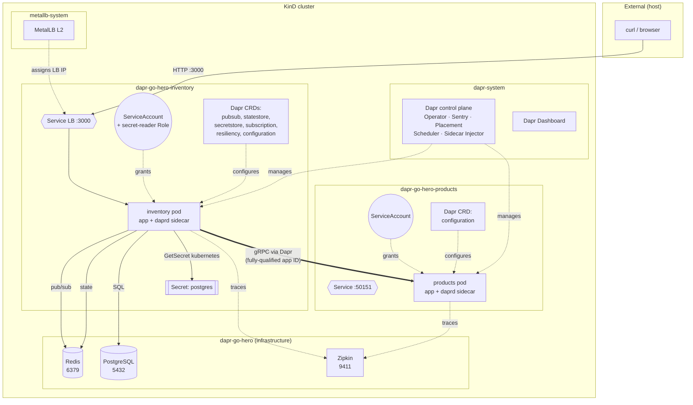
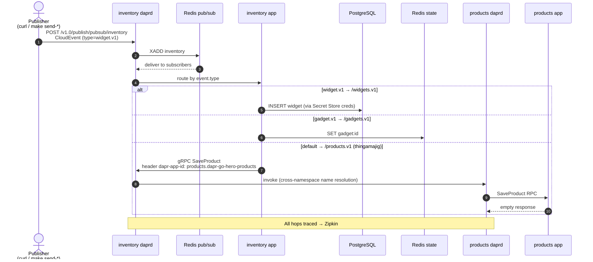

[](https://github.com/AndriyKalashnykov/dapr-go-hero/actions/workflows/ci.yml)
[](https://hits.sh/github.com/AndriyKalashnykov/dapr-go-hero/)
[](https://opensource.org/licenses/MIT)
[](https://app.renovatebot.com/dashboard#github/AndriyKalashnykov/dapr-go-hero)

# From Zero to Hero with Go and Dapr

[Slides](slides.pdf)

This is a Go application demonstrating the key features of [Dapr](https://dapr.io) with a few different approaches. Built with Fiber v3, pgx v5, gRPC/protobuf, Redis, and PostgreSQL. My goal is to help you pick the best fit for your needs and level up as a microservices developer.

Dapr, at its core, is a set of building block APIs that abstract away common tasks so you can focus on what matters most-- business value/features. We will focus on the building blocks that I consider as the most useful for Go developers.

* Publish / Subscribe (with routing)
* Secret store
* State store
* Service Invocation (with discovery and tracing)

## Quick Start

Two modes are supported: **local dev** (standalone binaries + `dapr run`) and **Kubernetes** (KinD + MetalLB + Dapr + all services in containers).

### Option A — Kubernetes (recommended, full stack)

One command spins up a local KinD cluster with MetalLB, installs Dapr + Dashboard, builds images, and deploys everything:

```bash
make e2e-setup          # kind-up + k8s-deploy (creates cluster, deploys stack)
make e2e                # run end-to-end tests (7 assertions)
make k8s-status         # show pod/service status across all namespaces
```

Once deployed, access UIs and APIs via port-forward:

| Service | URL | Command |
|---------|-----|---------|
| Inventory REST API | http://localhost:3000 | `kubectl port-forward svc/inventory 3000:3000 -n dapr-go-hero-inventory` |
| Dapr Dashboard | http://localhost:8080 | `kubectl port-forward svc/dapr-dashboard 8080:8080 -n dapr-system` |
| Zipkin tracing UI | http://localhost:9411 | `kubectl port-forward svc/zipkin 9411:9411 -n dapr-go-hero` |
| Redis | localhost:6379 | `kubectl port-forward svc/redis 6379:6379 -n dapr-go-hero` |
| PostgreSQL | localhost:5432 | `kubectl port-forward svc/postgres 5432:5432 -n dapr-go-hero` |

Query the REST API through the inventory port-forward:

```bash
curl http://localhost:3000/v1/widgets/widget | jq
curl http://localhost:3000/v1/gadgets/gadget | jq
curl http://localhost:3000/v1/products/thingamajig | jq
```

Tear down when done:

```bash
make e2e-teardown       # k8s-undeploy + kind-down
```

### Option B — Local dev (standalone binaries)

Requires `dapr init`, PostgreSQL container, and the `widgets` table from `tables.sql`. Each service runs as its own `go run`-ed process with a Dapr sidecar.

```bash
make deps               # install tool dependencies (mise, gosec, golangci-lint)
make build              # compile inventory and products binaries
make test               # run tests
make run-products       # start Products gRPC service (terminal 1)
make run                # start Inventory service with Dapr (terminal 2)
make send-all           # publish three test events (terminal 3)
make get-all            # query all three REST endpoints
```

See [Running the demo locally](#running-the-demo-locally) for the full PostgreSQL setup.

## Prerequisites

**Core (both modes):**

| Tool | Version | Purpose |
|------|---------|---------|
| [Go](https://go.dev/dl/) | 1.26.2+ | Language runtime and compiler (auto-installed via [mise](https://mise.jdx.dev)) |
| [GNU Make](https://www.gnu.org/software/make/) | 3.81+ | Build orchestration |
| [Docker](https://www.docker.com/) | latest w/ BuildKit | Container builds and local runtimes |
| [jq](https://jqlang.github.io/jq/) | latest | Pretty-printing JSON responses |

**Kubernetes mode (Option A):**

| Tool | Version | Purpose |
|------|---------|---------|
| [KinD](https://kind.sigs.k8s.io/) | 0.31.0+ | Local Kubernetes in Docker |
| [kubectl](https://kubernetes.io/docs/tasks/tools/) | latest | K8s CLI (bundled with KinD) |
| [Dapr CLI](https://docs.dapr.io/getting-started/install-dapr-cli/) | 1.17.0+ | `dapr init -k` installs runtime into KinD |

**Local dev mode (Option B):**

| Tool | Version | Purpose |
|------|---------|---------|
| [Dapr CLI](https://docs.dapr.io/getting-started/install-dapr-cli/) | 1.17.0+ | Provides Redis via `dapr init` |
| PostgreSQL | 16+ | Run as Docker container (see [Running the demo locally](#running-the-demo-locally)) |

**Optional:**

| Tool | Version | Purpose |
|------|---------|---------|
| [protoc](https://grpc.io/docs/protoc-installation/) | latest | Regenerating protobuf code |
| [act](https://github.com/nektos/act) | latest | Running GitHub Actions locally |
| [hadolint](https://github.com/hadolint/hadolint) | 2.12+ | Dockerfile linting (auto-installed by `make docker-lint`) |

Install all required tool dependencies:

```bash
make deps
```

## Available Make Targets

Run `make help` to see all available targets.

### Build & Test

| Target | Description |
|--------|-------------|
| `make build` | Build inventory and products binaries |
| `make test` | Run tests |
| `make clean` | Remove build artifacts |
| `make update` | Update dependencies to latest versions |

### Code Quality

| Target | Description |
|--------|-------------|
| `make lint` | Run golangci-lint (includes gocritic via .golangci.yml) |
| `make sec` | Run gosec security scanner |

### CI

| Target | Description |
|--------|-------------|
| `make ci` | Run full local CI pipeline |
| `make ci-run` | Run GitHub Actions workflow locally via [act](https://github.com/nektos/act) |

### Dapr Services

| Target | Description |
|--------|-------------|
| `make run` | Run inventory service with Dapr (default: SDK HTTP mode) |
| `make run-products` | Run Products gRPC service |
| `make run-custom-http` | Run inventory with custom HTTP client |
| `make run-custom-grpc` | Run inventory with custom gRPC client |
| `make run-sdk-http` | Run inventory with Go SDK HTTP client |
| `make run-sdk-grpc` | Run inventory with Go SDK gRPC client |
| `make dapr-test` | Run inventory with Dapr sidecar only (no app) |

### Publish Events

| Target | Description |
|--------|-------------|
| `make send-widget` | Publish widget event to Dapr PubSub |
| `make send-gadget` | Publish gadget event to Dapr PubSub |
| `make send-thingamajig` | Publish thingamajig event to Dapr PubSub |
| `make send-all` | Publish all three event types |

### Query REST API

| Target | Description |
|--------|-------------|
| `make get-widget` | Fetch widget from REST API |
| `make get-gadget` | Fetch gadget from REST API |
| `make get-thingamajig` | Fetch product from REST API |
| `make get-all` | Fetch all three items from REST API |

### Docker

| Target | Description |
|--------|-------------|
| `make docker-build` | Build inventory and products container images (BuildKit + Alpine) |
| `make docker-push` | Push images to `$(REGISTRY)` (default: `dapr-go-hero`) |
| `make docker-lint` | Lint Dockerfiles with hadolint |

### Kubernetes (KinD + MetalLB + Dapr)

| Target | Description |
|--------|-------------|
| `make kind-up` | Create KinD cluster + install MetalLB + install Dapr + Dashboard |
| `make kind-down` | Destroy KinD cluster |
| `make k8s-deploy` | Build images, load into KinD, apply all manifests |
| `make k8s-undeploy` | Remove all K8s manifests |
| `make k8s-status` | Show pod/service status across all namespaces |
| `make e2e` | Run end-to-end tests against running K8s cluster |
| `make e2e-setup` | Full setup: `kind-up` + `k8s-deploy` |
| `make e2e-teardown` | Full teardown: `k8s-undeploy` + `kind-down` |

### Utilities

| Target | Description |
|--------|-------------|
| `make help` | List available tasks |
| `make deps` | Install required tool dependencies (idempotent) |
| `make deps-act` | Install act for running GitHub Actions locally |
| `make deps-check` | Show Go version and mise tool status |
| `make deps-prune` | Remove unused and redundant dependencies |
| `make deps-prune-check` | Verify no prunable dependencies (CI gate) |
| `make generate-env` | Regenerate `.env` from `pkg/config` defaults |
| `make renovate-bootstrap` | Install nvm and npm for Renovate |
| `make release` | Create and push a new tag |
| `make renovate-validate` | Validate Renovate configuration |

## Design choices

When building Go microservices, we have many choices to make! gRPC, REST or both? Which HTTP router? How to organize packages?

In this application, packages are organized by purpose/feature. This creates a small hurdle for subscriptions because your application [responds with all of the topics in a single callback](https://docs.dapr.io/developing-applications/building-blocks/pubsub/howto-publish-subscribe/#step-2-subscribe-to-topics). To work around this, the subscriptions from each package are merged together into a single response.

You will find examples of "helper code" like this in `pkg/dapr`. However, be aware that the [Go SDK](https://github.com/dapr/go-sdk) is an abstraction over all of the Dapr APIs. It is up to you to decide on custom code or the SDK.

The Go SDK uses the [standard net/http package](https://pkg.go.dev/net/http). To be different, I choose [Fiber](https://gofiber.io/) as the HTTP router for public API traffic and found it to be straightforward to use.

Event callbacks, such as PubSub events, should be considered private communication. Because of this, I highly recommend having Dapr callbacks listen on a separate port that is not publicly exposed. The gRPC callback listener binds to the loopback interface (`127.0.0.1`) only for this reason.

## Application flow

With the design decisions out of the way, let's look at the scenarios and specifically how the Dapr building blocks are used.

There are three code paths. Each starts with the receipt of a Pub/Sub event. By default, Dapr uses [CloudEvents](https://cloudevents.io/) envelopes to encapsulate event data. This allows Dapr to attach tracing IDs and [route the event](https://docs.dapr.io/developing-applications/building-blocks/pubsub/howto-route-messages/) based on attributes such as type.

The application is an Inventory service, where products are persisted in different stores based on type. `Widgets` are stored in a PostgreSQL database. `Gadgets` are stored in a State store, such as Redis or MongoDB. All other product types are stored in a separate service exposed through gRPC.


By inspecting `event.type`, Dapr selects one of three routes (URIs) to invoke.

To connect to the PostgreSQL database, the application uses a Secret Store to acquire the needed credentials in order to connect. From there, the [jackc/pgx](https://github.com/jackc/pgx) package is used to execute SQL statements.

Gadgets are saved simply by calling the "Save state" operation of the [State management API](https://docs.dapr.io/reference/api/state_api/).

Finally, general products are stored in the Products gRPC service. The developer uses the generated gRPC client as normal; however, the endpoint is the Dapr sidecar and an additional `dapr-app-id` metadata field is attached to the request so Dapr know how to route the request. See this [How-To](https://docs.dapr.io/developing-applications/building-blocks/service-invocation/howto-invoke-services-grpc/) for more details.

All component configurations are located in the `components` directory. The main Dapr configuration is in `config.yaml` and is where tracing and preview features are enabled.

## Kubernetes Architecture

The project ships with production-like Kubernetes manifests in `k8s/`, demonstrating Dapr's full feature set in a real cluster.

### Cluster Topology



### Event Flow (CloudEvent → 3 routes)



### Namespace Layout (isolated by service)

| Namespace | Contents | RBAC |
|-----------|----------|------|
| `dapr-go-hero` | Shared infrastructure: Redis, PostgreSQL, Zipkin | — |
| `dapr-go-hero-inventory` | Inventory deployment + Dapr components | ServiceAccount with `secret-reader` Role (for `secretstores.kubernetes`) |
| `dapr-go-hero-products` | Products gRPC service + Dapr configuration | ServiceAccount with minimal permissions |

### Dapr Features in K8s (k8s/dapr/)

| File | Kind | What it demonstrates |
|------|------|----------------------|
| `pubsub.yaml` | Component | Redis pub/sub with FQDN addressing |
| `statestore.yaml` | Component | Redis state store, scoped to `inventory` app |
| `secretstore.yaml` | Component | K8s-native secret store (reads from the namespace's Secrets) |
| `subscription.yaml` | Subscription (v2alpha1) | Declarative routing: `widget.v1` → `/widgets.v1`, `gadget.v1` → `/gadgets.v1`, default → `/products.v1` |
| `resiliency.yaml` | Resiliency | Retry, timeout, circuit breaker policies on state/pubsub and `products` service |
| `configuration.yaml` | Configuration | Zipkin tracing, mTLS, access control policies (per namespace) |

### Cross-Namespace Service Invocation

When inventory invokes products across namespaces, a **fully-qualified app ID** is required (`products.dapr-go-hero-products`) because Dapr's default resolver is namespace-scoped. This is set via `PRODUCTS_APP_ID` env var in the inventory deployment manifest. See [`docs/containerize-and-deploy.md`](docs/containerize-and-deploy.md) for the full gotcha.

### Configuration as Code

All runtime configuration (ports, addresses, app IDs) lives in `pkg/config/config.go` with a single `defaults` slice as the source of truth. `make generate-env` regenerates `.env` from the same source. K8s deployments set the same keys as `env:` entries in the pod spec.

### Container Images

Multi-stage Alpine Dockerfiles with BuildKit cache mounts (`Dockerfile.inventory`, `Dockerfile.products`). Rebuild in ~0.2s after initial build.

### Local Cluster

`make kind-up` creates a KinD cluster with:
- **MetalLB** (L2 mode) for LoadBalancer Service support
- **Dapr runtime** via `dapr init -k` (Sentry, Operator, Placement, Scheduler, Sidecar Injector)
- **Dapr Dashboard** for cluster inspection

## Running the demo locally

For the Kubernetes-based demo, see [Quick Start → Option A](#option-a--kubernetes-recommended-full-stack). This section covers the standalone-binary local dev flow.

After running `dapr init`, you should have Redis running in a Docker container. You will need to create a PostgreSQL database and update `secrets.json` accordingly. Then create the `widgets` table from `tables.sql`.

```shell
docker run --name postgres -e POSTGRES_PASSWORD=postgres -p 5432:5432 -d postgres
cat tables.sql | docker exec -i postgres psql -U postgres -d postgres
```

**Start the Products service**

```shell
make run-products
```

**Start the main Inventory service**

In a second terminal run: (_Pick the client mode_)

```shell
make run-custom-http
make run-custom-grpc
# or
make run-sdk-http
make run-sdk-grpc
```

**Send product events**

In a third terminal you can publish the 3 product event types. The contents of each message are located in the `messages` directory.

Send a Widget: This will save in the PostgreSQL database.

```shell
make send-widget
```

Send a Gadget: This will save in the Redis state store.

```shell
make send-gadget
```

Send a Thingamajig: This will invoke the Products service using Dapr for service discovery and mTLS authentication.

```shell
make send-thingamajig
```

**Query the REST API**

```shell
make get-widget
make get-gadget
make get-thingamajig
# or all at once
make get-all
```

That's it!

I hope this was helpful! If you have better ways of handling anything in this sample, please submit a PR! :)

## CI/CD

GitHub Actions runs on every push to `main`, tags `v*`, pull requests, and `workflow_call`.

| Job | Depends on | Steps |
|-----|-----------|-------|
| **static-check** | — | Lint, Security, Tidy check |
| **docker-lint** | — | Hadolint on Dockerfiles (parallel with static-check) |
| **build** | static-check | Build Go binaries |
| **test** | static-check | Unit + integration tests |
| **e2e** | build, test | KinD + MetalLB + Dapr, deploy, run `tests/e2e.sh` |

The `e2e` job provisions a full KinD cluster on every PR, loads images, deploys all manifests, and runs 7 end-to-end assertions against the real Dapr stack.

[Renovate](https://docs.renovatebot.com/) keeps dependencies up to date with platform automerge enabled.

A separate cleanup workflow (`.github/workflows/cleanup-runs.yml`) removes old workflow runs weekly.

## References

* [From Zero to Hero with Go and Dapr](https://github.com/pkedy/golang-dapr)
* [Code - Building Cloud-Native Services with Dapr, Go, and Kubernetes](https://github.com/vladimirvivien/dapr-examples)
* [Article - Building Cloud-Native Services with Dapr, Go, and Kubernetes](https://medium.com/@vladimirvivien/building-cloud-native-services-with-dapr-go-and-kubernetes-part-2-f773d484ecb0)
